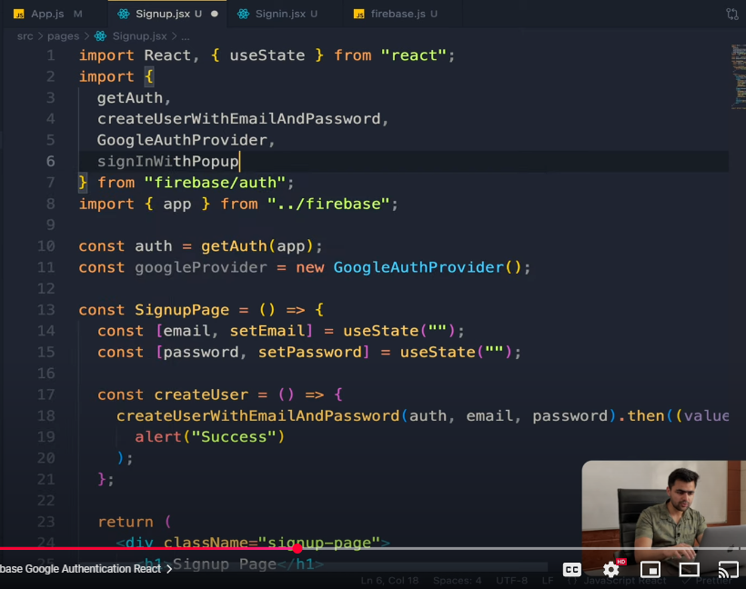
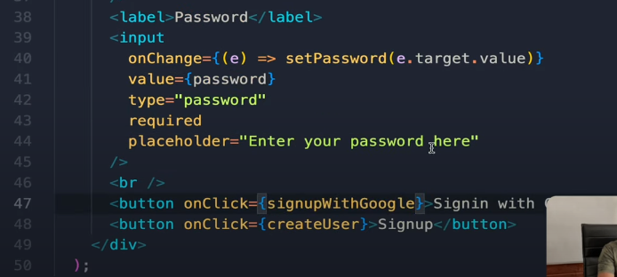
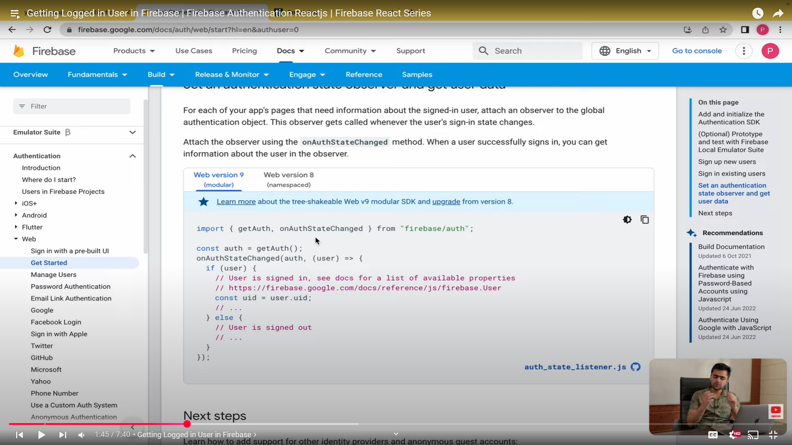
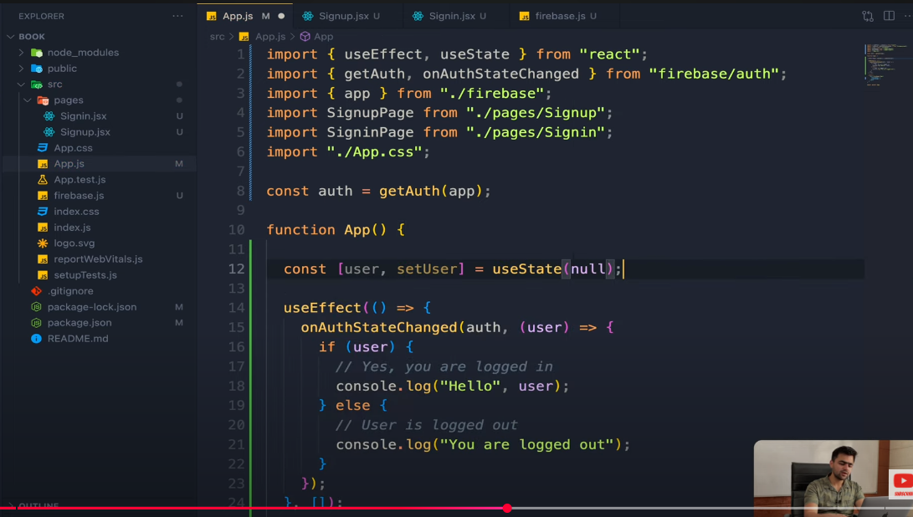
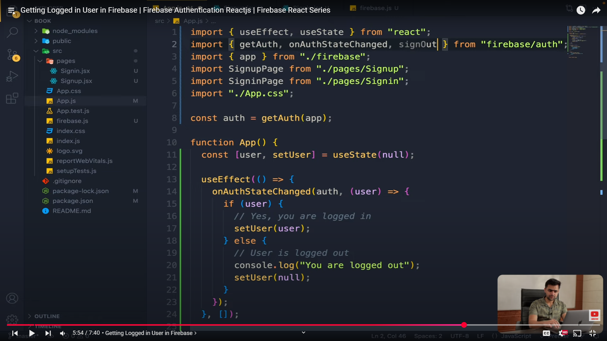
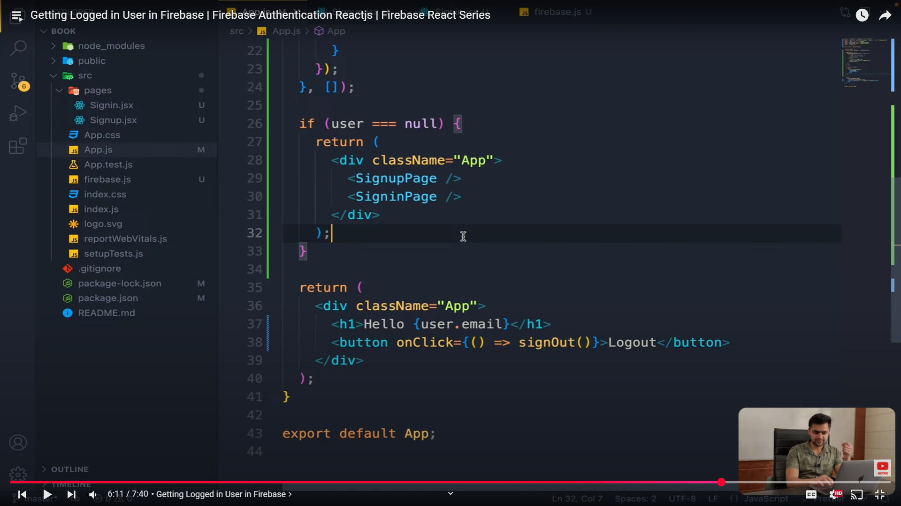

# CRUD in Firebase REALtime Database

[GeeksForGeek](https://www.geeksforgeeks.org/firebase-tutorial/#firebase-realtime-database) read this for CRUD in **Realtime database** in firebase

### Write data
Method 1: Using set() Method
+ **overwrites** data at the specified path.
+ If the data doesn't exist, it creates it. 
+ used to set initial data or to completely overwrite existing data.

```javascript
database.ref('users/1').set({
  username: 'john_doe',
  email: 'john@example.com'
});
```


### Read data

### write data


# Authentication


<br>
<br>

## Signin with Google
<!--  -->




<br>
<br>

## checking if user logged in or not

<!--  -->

<!--  -->

